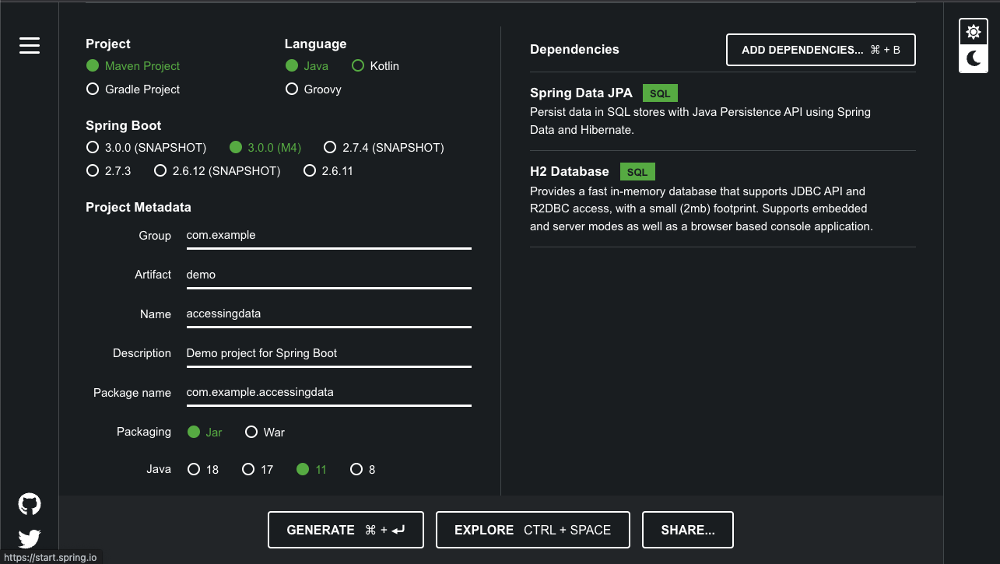

# Ejemplo 01 - JPA

## Requisitos

- IntelliJ IDEA Community Edition
- Apache Maven 3.8.4 o superior
- JDK (o OpenJDK)
- Navegador Web

## Objetivo 

- Comenzar a utilizar Java Persistence API

## Preparativos

Comenzaremos generando un proyecto utilizando Spring Initializr.

1. Abrimos el navegador y entramos a [Spring Inilializr](https://start.spring.io/).

2. Seleccionamos Maven como gestor de proyecto.

3. Seleccionamos Java como lenguaje de programación.

4. Seleccionamos la versión 3.0.0 (M4) de Spring Boot.

5. Como nombre del proyecto ponemos accessingdata.

6. Como nombre del paquete **com.example.accessingdata**

7. La versión de Java que usaremos sera la 11.

Debe de quedar como la configuración de la imagen siguiente:



<br/>

### Definiendo entidades  

En este ejemplo, definiremos una entidad **Customer** para gestionar los objetos de esta clase.

1. Creamos una clase nueva `src/main/java/com/example/accessingdata/Customer.java`.

2. Agregamos la etiqueta `@Entity` a la clase, para indicar que se trata de una entidad.

3. La clase `Customer` tiene tres atributos: `id`, `firstName` y `lastName`.

```java 
@Entity
public class Customer {

  @Id
  @GeneratedValue(strategy=GenerationType.AUTO)
  private Long id;
  private String firstName;
  private String lastName;
}
```
La etiqueta `@Id` le indica a JPS que el atributo `id` es el identificador para la clase `Customer` mientras que `@GeneratedValue(strategy=GenerationType.AUTO)` indica que el id debe generarse automáticamente.

4. Para los constructores de clase, primero definimos un constructor por default, este es necesario para el correcto funcionamiento de JPA. No vamos a usar este constructor directamente por lo que es definido como protected.

```java 
    protected Customer() {}
```

5. También definimos un constructor que recibe los parámetros `firstName` y `lastName`.

```java
public Customer(String firstName, String lastName) {
    this.firstName = firstName;
    this.lastName = lastName;
}
```

6. El método `toString()` nos permite formatear los objetos de la clase para imprimirlos de una forma mas legible.

```java
  @Override
  public String toString() {
    return String.format(
        "Customer[id=%d, firstName='%s', lastName='%s']",
        id, firstName, lastName);
  }
```

6. Por último definimos los getters para cada uno de los atributos de la clase.

```java
  public Long getId() {
    return id;
  }

  public String getFirstName() {
    return firstName;
  }

  public String getLastName() {
    return lastName;
  }
```
6. La clase completa debe verse de la siguiente forma

```java
package com.example.accessingdata;

import jakarta.persistence.Entity;
import jakarta.persistence.GeneratedValue;
import jakarta.persistence.GenerationType;
import jakarta.persistence.Id;


@Entity
public class Customer {

    @Id
    @GeneratedValue(strategy= GenerationType.AUTO)
    private Long id;
    private String firstName;
    private String lastName;

    protected Customer() {}

    public Customer(String firstName, String lastName) {
        this.firstName = firstName;
        this.lastName = lastName;
    }

    @Override
    public String toString() {
        return String.format(
                "Customer[id=%d, firstName='%s', lastName='%s']",
                id, firstName, lastName);
    }

    public Long getId() {
        return id;
    }

    public String getFirstName() {
        return firstName;
    }

    public String getLastName() {
        return lastName;
    }
}
```
    
## Creando un repositorio

Spring Data JPA se enfoca en usar JPA para almacenar datos en una base de datos relacional. Su característica más convincente es la capacidad de crear implementaciones de repositorio automáticamente, en tiempo de ejecución, desde una interfaz de repositorio. Es por esto que nosotros no tenemos que crear el repositorio en sí, solo decirle mediante una interfaz como debe de funcionar este.

1. Vamos a crear una interfaz `src/main/java/com/example/accessingdata/CustomerRepository.java` 

```java
package com.example.accessingdata;

import java.util.List;

import org.springframework.data.repository.CrudRepository;

public interface CustomerRepository extends CrudRepository<Customer, Long> {

    List<Customer> findByLastName(String lastName);

    Customer findById(long id);
}
```

Esta interfaz extiende `CrudRepository` para lo que se indica el tipo de la entidad y de su identificador. Al extender de `CrudRepository` se heredan métodos para manejar `Customer` de forma persistente, generando un CRUD completo para esta entidad.

Adicional a los métodos heredados, también podemos definir métodos de CRUD más especializados como lo es `findByLastName` o `findById`, para lo cual sólo tenemos que declarar la firma del método.

## Probando la aplicación.

1. Vamos a ir a la clase `src/main/java/com/example/accessingdata/AccessingDataJpaApplication.java` en donde se inicializó una implementación base para el proyecto usando la anotación `@SpringBootApplication` y dentro del método main se usa el método`SpringApplication.run()` para lanzar la aplicación con la configuración por defecto. 

Vamos a modificar esta clase para probar nuestra aplicación.

```java
package com.example.accessingdata;

import org.slf4j.Logger;
import org.slf4j.LoggerFactory;
import org.springframework.boot.CommandLineRunner;
import org.springframework.boot.SpringApplication;
import org.springframework.boot.autoconfigure.SpringBootApplication;
import org.springframework.context.annotation.Bean;

@SpringBootApplication
public class AccessingDataJpaApplication {

    private static final Logger log = LoggerFactory.getLogger(AccessingDataJpaApplication.class);

    public static void main(String[] args) {
        SpringApplication.run(AccessingDataJpaApplication.class);
    }

    @Bean
    public CommandLineRunner demo(CustomerRepository repository) {
        return (args) -> {
            // creamos algunos customers
            repository.save(new Customer("Jack", "Bauer"));
            repository.save(new Customer("Chloe", "O'Brian"));
            repository.save(new Customer("Kim", "Bauer"));
            repository.save(new Customer("David", "Palmer"));
            repository.save(new Customer("Michelle", "Dessler"));

            // buscamos todos los customers
            log.info("Customers found with findAll():");
            log.info("-------------------------------");
            for (Customer customer : repository.findAll()) {
                log.info(customer.toString());
            }
            log.info("");

            // buscamos individual por ID
            Customer customer = repository.findById(1L);
            log.info("Customer found with findById(1L):");
            log.info("--------------------------------");
            log.info(customer.toString());
            log.info("");

            // buscamos por lastName
            log.info("Customer found with findByLastName('Bauer'):");
            log.info("--------------------------------------------");
            repository.findByLastName("Bauer").forEach(bauer -> {
                log.info(bauer.toString());
            });
           
            log.info("");
        };
    }
}
```

2. Al correr el programa la salida debe verse algo así:

```java
== Customers found with findAll():
Customer[id=1, firstName='Jack', lastName='Bauer']
Customer[id=2, firstName='Chloe', lastName='O'Brian']
Customer[id=3, firstName='Kim', lastName='Bauer']
Customer[id=4, firstName='David', lastName='Palmer']
Customer[id=5, firstName='Michelle', lastName='Dessler']

== Customer found with findById(1L):
Customer[id=1, firstName='Jack', lastName='Bauer']

== Customer found with findByLastName('Bauer'):
Customer[id=1, firstName='Jack', lastName='Bauer']
Customer[id=3, firstName='Kim', lastName='Bauer']
```


<br/>

¡Felicidades! Completaste el primer ejemplo.

<br/>

[Siguiente ](../Reto-01/Readme.md)(Reto 1)