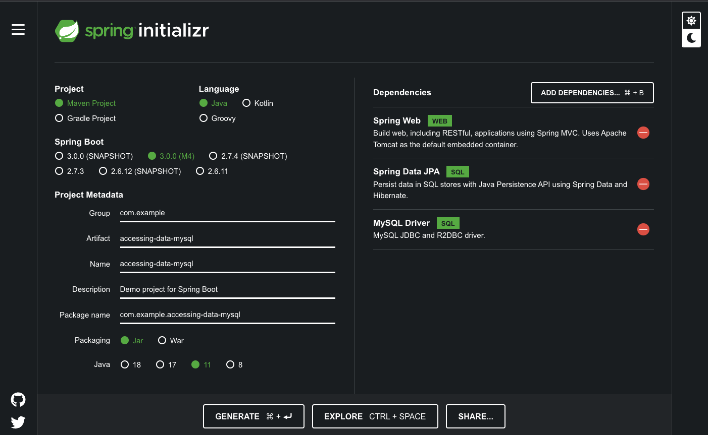

# Ejemplo 02 - Configuración de una Base de datos

## Objetivo

- Configurar la base de datos en MySQL para usarla dentro de la aplicación.

## Requisitos

- MySQL 
- Apache Maven 3.8.4 o superior
- Manejador de base de datos, de preferencia MySQL o MariaDB
- JDK (o OpenJDK)

## Desarrollo
 
Vamos a crear nuestra base de datos y los usuarios de acceso a ella.

1. Abrimos desde la terminal el cli de mysql.

```bash
$ mysql -uroot -p
```

esto nos pedirá nuestra contraseña para el usuario `root` que configuramos en la instalación de mySQL.

2. Una vez dentro del cli de mysql vamos a crear una base de datos de ejemplo.

```sql
mysql> create database db_example;
```

3. Ahora crearemos dos usuarios.

```sql
mysql> create user 'springuser'@'%' identified by 'ThePassword';
mysql> create user 'springadmin'@'%' identified by 'AdminPassword';
```

4. Consederemos permisos de acceso a estos usuarios sobre nuestra base de datos.

```sql
mysql> grant SELECT on db_example.* to 'springuser'@'%';
mysql> grant all on db_example.* to 'springadmin'@'%';
```

## Creando el proyecto 

Comenzaremos generando un proyecto utilizando Spring Initializr.

1. Abrimos el navegador y entramos a [Spring Inilializr](https://start.spring.io/).

2. Seleccionamos Maven como gestor de proyecto.

3. Seleccionamos Java como lenguaje de programación.

4. Seleccionamos la versión 3.0.0 (M4) de Spring Boot.

5. Como nombre del proyecto ponemos accessing-data-mysql.

6. Como nombre del paquete **com.example.accessing-data-mysql**

7. La versión de Java que usaremos sera la 11.

8. Agregamos las dependencias **Spring Web**, **Spring Data JPA**, y **MySQL Driver**.

Debe de quedar como la configuración de la imagen siguiente:



<br/>

## Conexión del proyecto con la base de datos

1. Abrimos el archivo `src/main/resources/application.properties` y agregamos lo siguiente:

```
spring.jpa.hibernate.ddl-auto=update
spring.datasource.url=jdbc:mysql://localhost:3306/db_example
spring.datasource.username=springuser
spring.datasource.password=ThePassword
spring.datasource.driver-class-name=com.mysql.cj.jdbc.Driver
#spring.jpa.show-sql: true
```

Ejecutamos el proyecto y la conexión debe establecerse correctamente.

¡Felicidades! Creaste tu conexión.

<br/>

[Siguiente ](../Reto-02/Readme.md)(Reto 2)