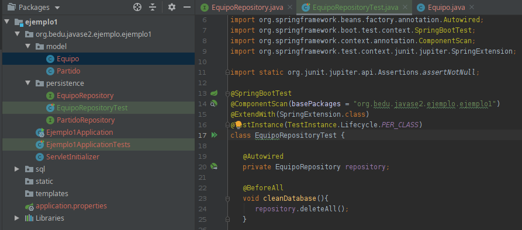
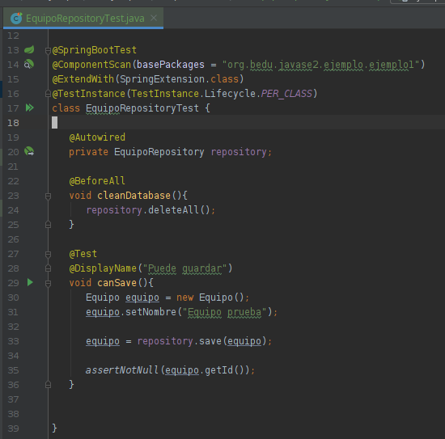
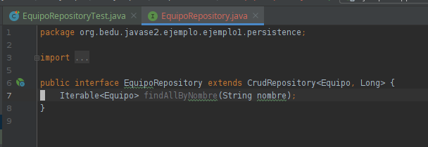
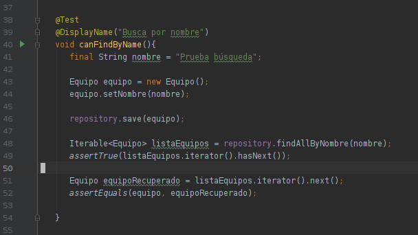

## Ejemplo 3

### OBJETIVO
 - Hacer pruebas con JUnit para verificar el correcto funcionamiento de los repositorios.

### REQUISITOS

- Apache Maven
- JDK 12 
- IDE de tu preferencia

### DESARROLLO

En este ejercicio harás uso de pruebas de integración (Spring + JUnit) para verificar el funcionamiento del repositorio de
equipos.

**_Nota_**: Para ejecutar las prebas con maven usa el comando

```bash
  mvn test
```

1. Crea una clase de prueba para EquipoRepository con el contenido que se muestra en la figura.

   

2. Agrega una prueba donde crees un equipo y lo guardes como se muestra.

   

   Esta prueba verifica que el objeto, una vez guardado, tiene un Id asignado por la base de datos.

3. Agreaga un método en EquipoRepository para buscar por nombre. Observa que el método puede devolver más de un elemento ya que la base de datos no tiene la restrucción de unicidad, por lo que no podemos hacer ninguna suposición.

   

4. Agrega una nueva prueba para verificar el comportamiento.

   


