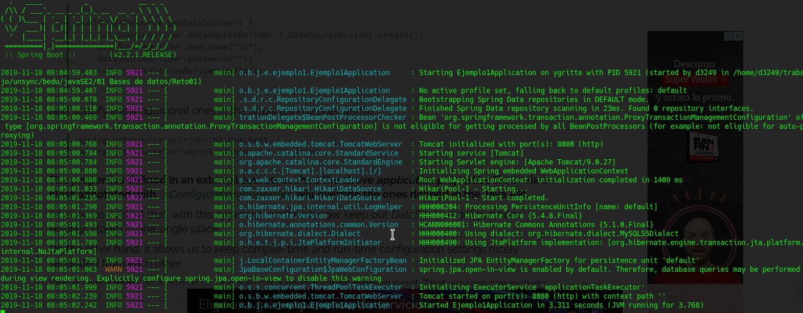

# Reto 01

## Objetivo

- Realizar las correcciones necesarias en la aplicación para poder hacer un número mayor de operaciones adicionales a la consulta.

## Desarrollo

En el Ejemplo 01 agregamos los datos para conectarnos a la base de datos con el usuario **_usuario_**. Sin embargo este es un usuario limitado, si revisas el script de la base de datos te darás cuenta de que sólo puede hacer consultas.

En este reto deberás modificar los datos de conexión para que la aplicación pueda hacer las operaciones **CRUD** (Create, Read, Update, Delete).

 

  
Solución

 1. Abre el archivo **application.properties**.

 2. Cambia los datos de conexión a los del usuario **admin**:
 
    
 
 3. Valida la conexión
  
    

  La solución mostrada puede no ser la óptima, ya que se están dando todos los privilegios al usuario <b>admin</b>, lo que puede representar un riesgo de seguridad.

  Lo más correcto sería seguir el <a href="https://en.wikipedia.org/wiki/Principle_of_least_privilege">principio de permisos mínimos</a> y crear un usuario específico para la aplicación.
  Esto cae en el área de administración de bases de datos, por lo que para nuestros ejemplos seguiremos usando el usuario <b>admin</b>.

 

[Siguiente ](../Ejemplo-02/Readme.md)(Ejemplo 2)