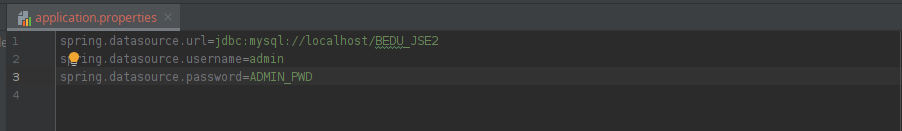

# Reto 01

## Objetivo

- Prácticar el uso de JPA

## Requisitos

- IntelliJ IDEA Community Edition
- Apache Maven 3.8.4 o superior
- JDK (o OpenJDK)
- Proyecto con Spring Data (Proyecto del ejemplo 01)

## Desarrollo

Para este reto debes extender la aplicación que generamos en el ejemplo anterior, agregando una nueva entidad **Product** con los campos: `id`, `name` y `price`. Esta entidad debe contar con su propio repositorio con métodos de búsqueda por id y nombre. Agrega también algunas pruebas de éstos métodos a la clase principal.

 

<!-- 

  
Solución

 1. Abre el archivo **application.properties**.

 2. Cambia los datos de conexión a los del usuario **admin**:
 
    
 
 3. Valida la conexión
  
    

    

      La solución mostrada puede no ser la óptima, ya que se están dando todos los privilegios al usuario <b>admin</b>, lo que puede representar un riesgo de seguridad.
    

    

      Lo más correcto sería seguir el <a href="https://www.cyberark.com/es/what-is/least-privilege/">principio de permisos mínimos</a> y crear un usuario específico para la aplicación.
      Esto cae en el área de administración de bases de datos, por lo que para nuestros ejemplos seguiremos usando el usuario <b>admin</b>.
    

 -->

 

[Siguiente ](../Ejemplo-02/Readme.md)(Ejemplo 2)