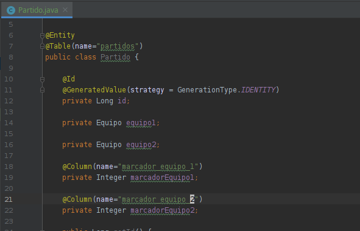
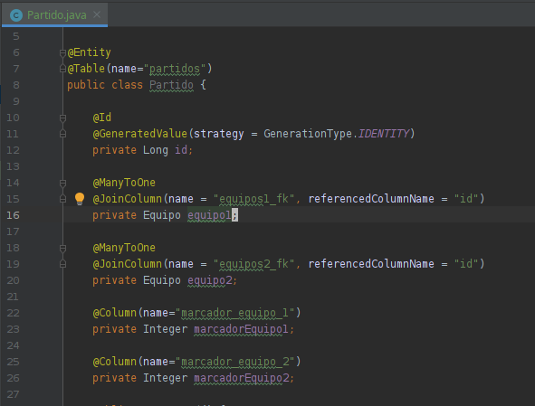
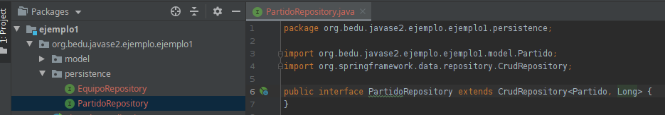

## Reto 2

### OBJETIVO

 - Crear una entidad que representa la información de la tabla **partido**.
 - Crear un *repositorio* que permita trabajar con la entidad **Partido**.

### REQUISITOS

- Haber terminado el Ejemplo 02

### DESARROLLO

En el Ejemplo 2 creaste tu primera entidad y repositorio. En ese ejercicio la clase era sencilla (no tiene agregación de ninguna otra). 

Para este reto deberás crear la entidad y repositorio de un partido.

Deberás hacer uso de las anotaciones **@ManyToOne** y **@JoinColumn**.

  
Solución

 1. Crea la clase **Partido** en el paquete **model** y agrega los atributos y código generado igual que en el Ejemplo 2.
         
  ![POJO] (img/figura01.png)
  
 2. Agrega las anotaciones básicas para los atributos sencillos y para la clase.
 
  
      
 3. Agrega la anotacion **@ManyToOne** y **@JoinColumn** como se muestra en la imagen:
 
  
      
 4. Agrega el repositorio igual que en el Ejemplo 2:
	
 

  

  Para validar que todo esté correcto, inicia la aplicación con maven.
  

