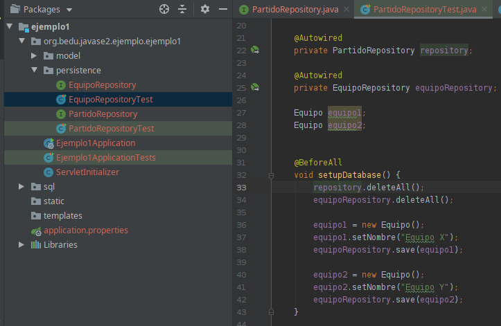
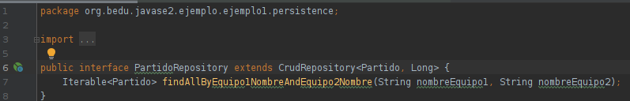

## Reto 3

En el Ejemplo 3 creaste un QueryMethod para la búsqueda de equipo por nombre. En este reto crearás un método para buscar un partido por el nombre de los partidos.

  
Solución

 1. Crea el archivo de prueba tal como hiciste en el Ejemplo 3. En este caso tendrás que agregar ambos repositorios para poder hacer el setup completo.</li>

 

 deberás agregar el repositorio de partidos a la prueba de equipos, ya que no podemos garantizar el orden en que se ejecutan las pruebas y por las restricciones de llave foránea podríamos tener problemas al reiniciar la tabla. Este tipo de comportamiento de uso común es un excelente candidato para crear una clase de soporte).

 2. Crea el QueryMethod:
 
  

Como puedes ver, podemos definir criterios de búsqueda en objetos anidados. ¿Puedes definir la sentencia SQL equivalente?

  

  Para validar que todo esté correcto, ejecuta la prueba con maven.
  

