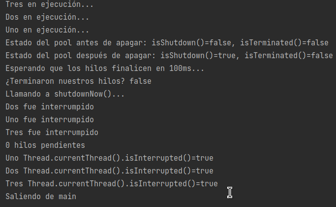

# Ejemplo 03: Usando Thread Pools

## Objetivo

- Conocer la API Executors mediante la creación de un Pool que contenga varios Thread

## Requisitos

- IntelliJ IDEA Community Edition
- JDK (o OpenJDK) 17

## Desarrollo

1. Nos ubicamos en el proyecto del ejemplo 2.

2. Agregamos una nueva clase llamada `MiRunnablePool`, que será muy similar a la clase que creamos durante el ejemplo 2 pero ahora su implementación será:

    ```java
    public class MiRunnablePool implements Runnable {
        private String nombre;

        public MiRunnablePool(String nombre) {
            this.nombre = nombre;
        }

        @Override
        public void run() {
            try{
                while(true){
                    System.out.println(nombre + " en ejecución...");
                    TimeUnit.SECONDS.sleep(1);
                }
            } catch (InterruptedException e) {
                System.out.println(nombre + " fue interrumpido");
                System.out.println(nombre + " Thread.currentThread().isInterrupted()=" + Thread.currentThread().isInterrupted());
            }
        }
    }
    ```

    Nota cómo ahora no tenemos un parámetro que nos ayude a interrumpir la ejecución, pues nuestro hilo va a ser controlado por un ExecutorService. Es por esto que estamos atrapando una excepción de tipo InterruptedException, que es lanzada por el método sleep si el ExecutorService nos ha detenido.

3. Lo que haremos a continuación es crear un pool que contenga solamente 3 hilos, va a esperar un cierto tiempo a que éstos terminen sus tareas y si no han terminado los interrumpirá para poder salir de la aplicación. Para ello agregamos lo siguiente a nuestro método main:

    ```java
    ExecutorService pool = Executors.newCachedThreadPool(); // creamos un pool preconfigurado

    String[] nombres = {"Uno", "Dos", "Tres"}; //los nombres para nuestros hilos
    for (String nombre : nombres) {
        pool.execute(new MiRunnablePool(nombre)); // creamos cada hilo y lo ejecutamos
    }
    System.out.println("Estado del pool antes de apagar: isShutdown()=" + pool.isShutdown() + ", isTerminated()=" + pool.isTerminated());
    pool.shutdown(); // Apagamos el pool para que no pueda recibir nuevos hilos

    //pool.execute(new MiRunnablePool("Cuatro")); // si tratamos de hacer esto recibiremos una excepción
    System.out.println("Estado del pool después de apagar: isShutdown()=" + pool.isShutdown() + ", isTerminated()=" + pool.isTerminated());

    try {
        long tiempoLimiteMs = 100;
        System.out.println("Esperando que los hilos finalicen en " + tiempoLimiteMs + "ms...");

        boolean terminaron = pool.awaitTermination(tiempoLimiteMs, TimeUnit.MILLISECONDS); //Esperamos a los hilos por 100ms, retorna true si acabaron antes o hasta los 100ms o false si fueron interrumpidos
        System.out.println("¿Terminaron nuestros hilos? " +  terminaron);

        if(!terminaron){
            System.out.println("Llamando a shutdownNow()...");JDK 8 o superior
            List<Runnable> pendientes = pool.shutdownNow(); //Termina los hilos que se estén ejecutando y retorna una lista de hilos pendientes a ejecutarse
            System.out.println(pendientes.size() + " hilos pendientes");
            terminaron = pool.awaitTermination(tiempoLimiteMs, TimeUnit.MILLISECONDS); //esperando otros 100ms a que terminen nuestros hilos

            if(!terminaron){
                System.out.println("Aún hay hilos pendientes");
            }
            System.out.println("Saliendo de main");
        }

    } catch (InterruptedException e) {
        e.printStackTrace();
    }
    ```

4. Si revisamos el resultado de la ejecución en consola, podemos ver que a pesar de haber interrumpido nuestros hilos, cuando llamamos al método `isInterrupted()` seguimos obteniendo false. Esto ocurre porque el estado de nuestro hilo es limpiado inmediatamente después de haber recibido el mensaje de interrupción. Es por esto que es nuestra responsabilidad verificar que estamos estableciendo el estado de interrupción. Nuestra clase `MiRunnablePool` queda entonces:

    ```java
    package org.bedu;

    import java.util.concurrent.TimeUnit;

    public class MiRunnablePool implements Runnable {
        private String nombre;

        public MiRunnablePool(String nombre) {
            this.nombre = nombre;
        }

        @Override
        public void run() {
            try{
                while(true){
                    System.out.println(nombre + " en ejecución...");
                    TimeUnit.SECONDS.sleep(1);
                }
            } catch (InterruptedException e) {
                Thread.currentThread().interrupt();
                System.out.println(nombre + " fue interrumpido");
                System.out.println(nombre + " Thread.currentThread().isInterrupted()=" + Thread.currentThread().isInterrupted());
            }
        }
    }
    ```

5. Ejecutamos el proyecto, ahora podemos ver que `isInterrupted()` marca true.

    


<br/>
<br/>

[Postwork ](../Postwork/Readme.md)(Postwork)