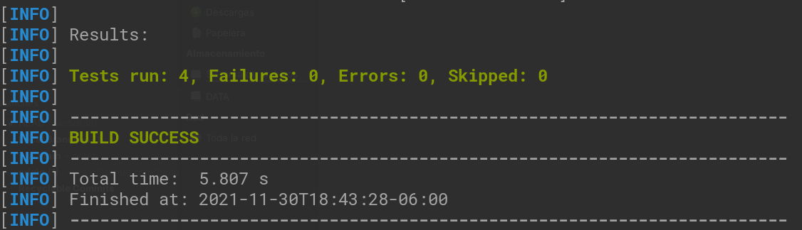
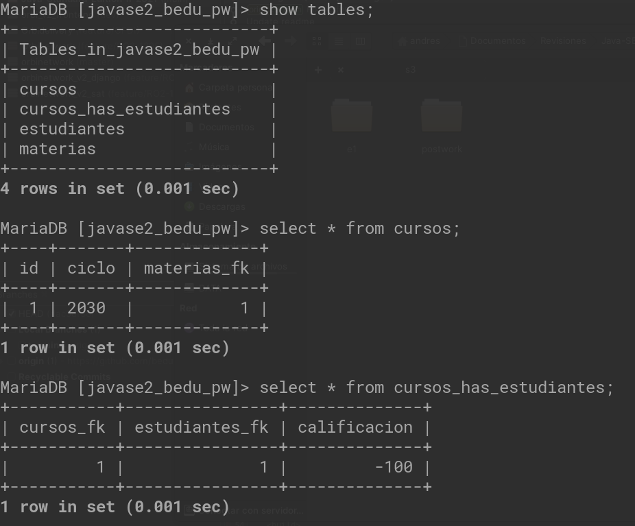
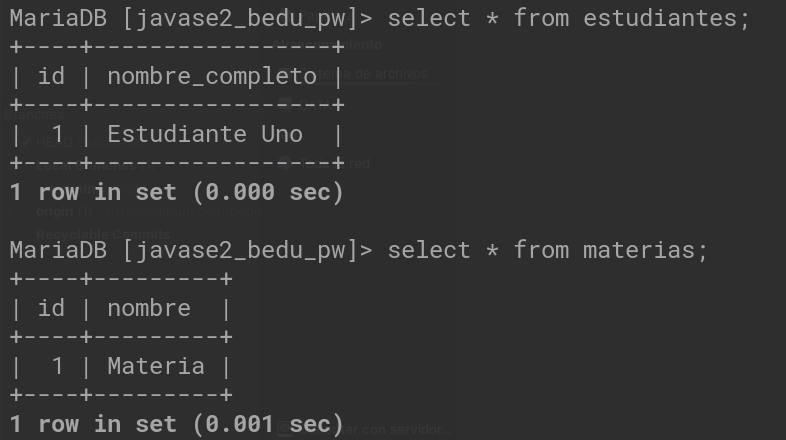

# Postwork 03

## Objetivo

- A lo largo de este proyecto reafirmaremos lo que se ha aprendido durante las sesiones.

 

## Módulo 3 - Programación funcional

Crea una clase que reciba un objeto Curso y que pueda generar una lista de calificaciones ordenada por orden alfabético (ascendente) o por calificaciones (descendente).

 

 
 

[Regresar ](../Readme.md)(Sesión 03)

[Siguiente ](../../Sesion-04/Readme.md)(Sesión 04)