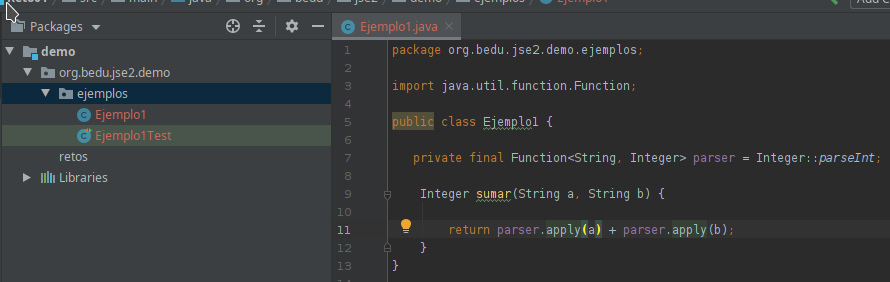

## Reto 01

### OBJETIVO
- Usar las interfaces propias de Java para poder realizar la conversión de un objeto de tipo **String** a un objeto de tipo **Integer**.

En el Ejemplo 1 creamos nuestra propia interfaz para convertir un `String` en un entero. Reemplaza esta interfaz propia por una de las genéricas que proporciona Java. 

  
Solución

 1. Elimina la interfaz **StringToInteger**

 2. Abre la clase **Ejemplo1**
      
 3. Reemplaza el uso de **StringToInteger** por **Function<String, Integer>** y el método **convertir** por **apply** (el método de la interfaz *Function*).
 
  

 4. Vuelve a ejecutar la prueba.

Javaprovee de un amplio conjunto de interfaces funcionales de uso general lo que nos permite no tener que definir las propias constantemente.

Es recomendable familiarizarse con este catálogo para poder usarlo cuando sea necesario.

