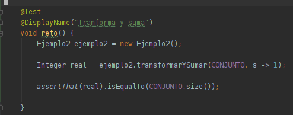
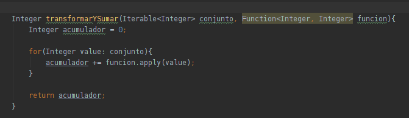

## Reto 02

### OBJETIVO

- Realizar una High Order Function un proceso para recibir un conjunto de enteros y realizar la suma de todos ellos.

### DESARROLLO

En el Ejemplo 2 creamos un método capaz de recibir un objeto Iterable de enteros y una función que los transforma. Para este reto deberás implementar el siguiente método

```java
    Integer transformarYSumar(Iterable<Integer> conjunto, Function<Integer, Integer> funcion);
```

<details>
  <summary>Solución</summary>

 1. Agrega un caso de prueba con el valor esperado:
 
 

 2. Abre la clase Ejemplo2 y agrega el siguiente código:
 
    
      
 3. Vuelve a ejecutar la prueba.

<p>
Los dos métodos que implementamos son semejantes a los operadores `map` y reduce de `Streams`. La diferencia es que aquellos no reciben un iterable, sino que Stream itera la función internamente.
</p>


</details>
