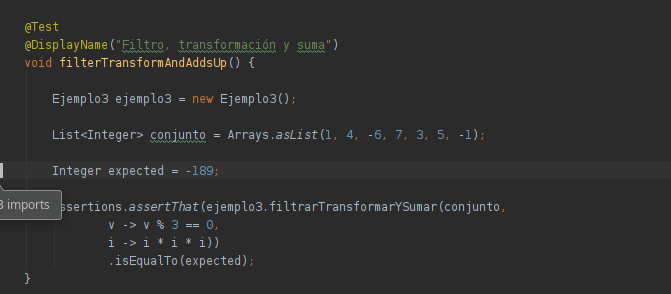
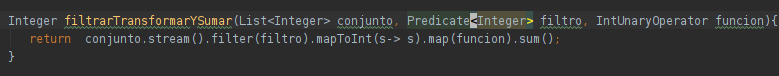

## Reto 3

En el Ejemplo 3 creamos un método capaz de recibir un una lista de enteros y una función que los transforma, sumando los valores. 

Para este reto deberás implementar el siguiente método que aplicará un filtro para aplicar la transformación sólo a los valores deseados.

```java
    Integer filtrarTransformarYSumar(List<Integer> conjunto, Predicate<Integer> filtro, IntUnaryOperator funcion);
```

<details>
  <summary>Solución</summary>

 1. Agrega un caso de prueba con el valor esperado:
 
 
	 
 2. Abre la clase Ejemplo2 y agrega el siguiente código:
 
  
	 
 3. Vuelve a ejecutar la prueba

</details>
