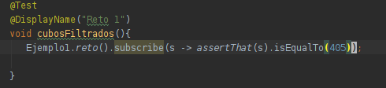
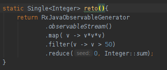

## Reto 1

### Objetivos
* Reafirmar la comprensión de las interfaces RxJava 
* Reafirmar el conocimiento de programación funcional

En el Ejercicio 1 partimos de un objeto `Observable<Integer>` para obtener su suma.

En esta ocasión debemos elevar al cubo cada elemento y sumar sólo los que sean mayores a 50.

  
Solución

  <ol>
      <li>Agrega una nueva prueba como se muestra<li>
         
      <li>Agrega el siguiente método a la clase Ejemplo1</li>
         
      <li>Vuelve a ejecutar la prueba</li>
  </ol>

Al igual que en programacion funcional común, podemos hacer uso de `.map` y `.filter`.

