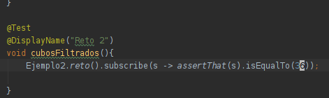
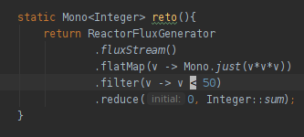

## Reto 2

### Objetivos
* Reafirmar la comprensión de las interfaces Project Reactor 
* Reafirmar el conocimiento de programación funcional

En el Ejercicio 2 partimos de un objeto Flux<Integer> para obtener su suma.

En esta ocasión debemos elevar al cubo cada elemento y sumar sólo los que sean menores a 50.

Restricciones:

usa flatMap en vez de map

  
Solución

  <ol>
      <li>Agrega una nueva prueba como se muestra<li>
         
      <li>Agrega el siguiente método a la clase Ejemplo1</li>
         
      <li>Vuelve a ejecutar la prueba</li>
  </ol>

.flatMap tiene dos casos de uso generales:

<ol>
<li>Cuando se desea procesar el stream/flux en paralelo</li>
<li>Cuando cada valor puede generar varios valores más (expansion de la lista)</li>
</ol>

Ten en cuenta que flatMap procesa en paralelo, por lo que el resultado final debe ser independiente del orden de ejecución de las operaciones/funciones (deben ser funciones puras).

