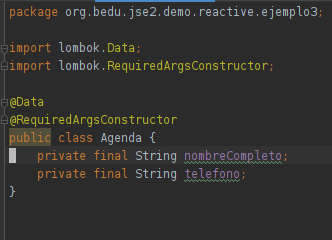
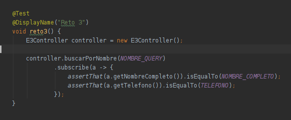
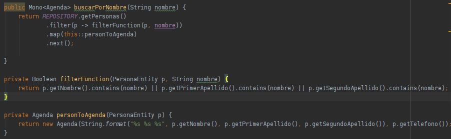
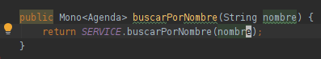

## Reto 3

### Objetivos
* Reafirmar el conocimiento de programación reactiva con servicios intermedios.

En el Ejercicio 3 usamos un servicio intermedio para transformar un Flux<PersonaEntity> en un Flux<String>.

En esta ocasión nos piden que la salida tenga el nombre completo y el teléfono de una persona dado su nombre o uno de sus apellidos.

Crea una nueva clase Agenda con el nombre completo y el número y haz que devuelva un Flux<Agenda>

  
Solución

  <ol>
      <li>Crea la calse Agenda<li>
         
      <li>Agrga el siguiente caso de prueba</li>
         
      <li>En el servicio agrega el código que filtre y transforme los resultados</li>
         
      <li>Finalmente, en el controlador agrega la llamada al servicio</li>
         
  </ol>

El método .next nos permite tomar el primer elemento de un Flux y reducirlo a un Mono

