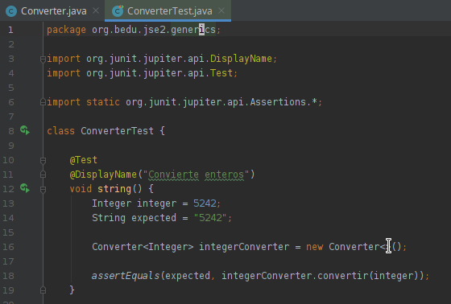
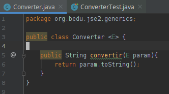

## Reto 1

### Objetivos
* Crear una clase que convierta entre dos tipos distingos 

En el Ejercicio 1 creamos una clase que puede almacenar un objeto genérico.

Para este ejercicio crea una clase que permita convertir un objeto cualquiera a una representación de string.

  
Solución

  <ol>
      <li>Agrega una nueva prueba como se muestra<li>
         
      <li>Crea una clase con la siguiente definición</li>
         
      <li>Vuelve a ejecutar la prueba</li>
  </ol>

    En este caso aprovechamos el método toString que está definido en la cima de la jerarquía de objetos Java (Object).

