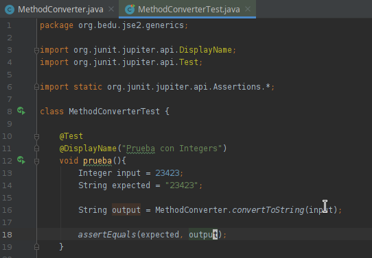
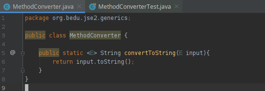

## Reto 2

### Objetivos
* Crear un método estático para convertir arbitráriamente 

En el Ejercicio 2 creamos una clase que aprovecha el método toString de Object.

Repite este comportamiento en un método estático.

  
Solución

  <ol>
      <li>Agrega una nueva prueba como se muestra<li>
         
      <li>Crea una clase con la siguiente definición</li>
         
      <li>Vuelve a ejecutar la prueba</li>
  </ol>

    En este caso aprovechamos el método toString que está definido en la cima de la jerarquía de objetos Java (Object).

