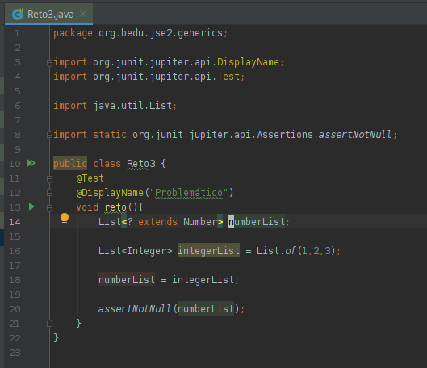

## Reto 3

### Objetivos
* Comprender las jerarquías de métodos genéricos

### Tip
  Puedes revisar el siguiente contenido [material](https://docs.oracle.com/javase/tutorial/java/generics/inheritance.html)

  
Solución

  <ol>
      <li>Para que el código funcione basta con establecer un límite superior al definir numList<li>
         
  </ol>

En este ejercicio creamos una jerarquía de clases genéricas, que requiere cierto tratamiento especial.

