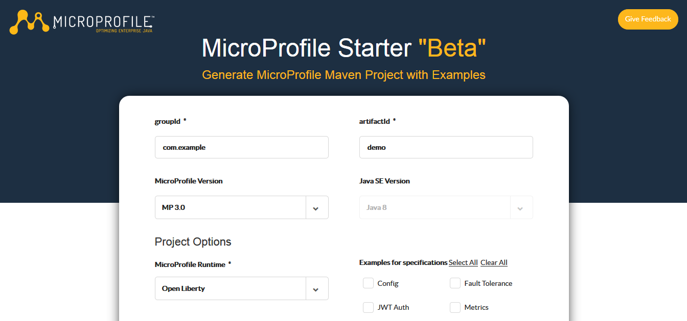

## Ejemplo 01: Usar MicroProfile para crear un microservicio

### Objetivos
* Familiarizarnos con microprofile

### Prerequisitos
* Maven
* JDK 11

### Procedimiento

1. Entrar a [MicroProfile Starter](https://start.microprofile.io/) 
2. Crea el proyecto demo como se muestra:

3. Descomprimir el proyecto
4. Abrir el proyecto con su IDE preferido y compilarlo, otra opcion es compilarlo con Maven:

    mvn clean package

4. Una vez compilado abrimos una terminal y nos colocamos en el directorio del proyecto y ejecutamos el siguiente comando:

    java -jar target/demo.jar

5. Una vez que termina de correr el proceso ingresamos con el navegador a:

    http://localhost:8181/index.html

